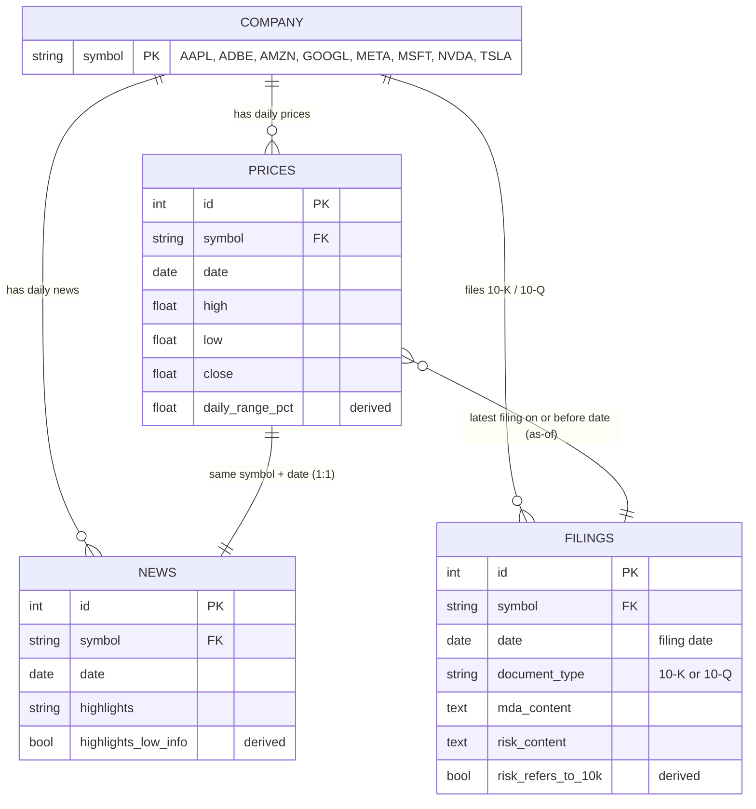

# 📈 Stock Movement Context Dashboard


**Spot unusual price moves in eight mega-cap stocks, then see the news and SEC filings from around the same time, all in one place.**

> ⚠️ This dashboard provides *context*, not causation. It does not predict prices or give investment advice.

### 📌 Module 6 submission (data cleaning)
| | |
|---|---|
| Student | Shreya |
| Branch | `cleaning-shreya` |
| Branch URL | https://github.com/04Shreya13/Stock_Movement_Context_Dashboard/tree/cleaning-shreya |
| Submitted commit | `COMMIT_ID_PENDING` |

---

## Table of Contents
1. [Project Overview & Business Value](#1-project-overview--business-value)
2. [Data Dictionary & Sources](#2-data-dictionary--sources)
3. [Tech Stack & Environment Setup](#3-tech-stack--environment-setup)
4. [Project Pipeline & Code Structure](#4-project-pipeline--code-structure)
5. [Results, Metrics & Key Insights](#5-results-metrics--key-insights)
6. [Team](#team)

---

## 1. Project Overview & Business Value

### Context & Problem Statement
An **investor-relations analyst** at a large investment firm has to explain sharp price movements in eight large-cap holdings before speaking with investors. They need to know whether a big move came from something **company-specific**, such as a product launch, an earnings surprise, or a risk disclosed in a filing, or whether it was part of a **broader market** move.

Right now that means jumping between price charts, news feeds, and long 10-K and 10-Q filings for each company. This project brings those three sources together in one workflow:

1. Select a company.
2. See the days when its daily price range was unusually wide.
3. Open one of those days to compare the **news highlights** with the **latest 10-K/10-Q discussion** (MD&A and risk factors).
4. Repeat for the other companies.

**Output:** a shortlist of *suggested* company-specific movements for a person to follow up on.

**Business question:** *On which days did each company's stock move unusually widely, and what company news and filings were around at the time?*

### Objectives
| # | Goal | How we measure it |
|---|------|-------------------|
| 1 | Flag each company's unusually wide daily price ranges | Top 5% of trading days per company by normalized daily range (17 days per company, 136 total) |
| 2 | Attach news context to every flagged day | Share of flagged days with a matching news row (result: 136 / 136) |
| 3 | Attach the most recent filing to every flagged day | Share of flagged days with a 10-K/10-Q on or before that day (result: 136 / 136) |
| 4 | Separate company-specific moves from market-wide moves | `co_flag_count`: how many of the 8 companies were flagged on the same day |
| 5 | Support one analyst-review decision | Analyst can go from company → flagged day → news + filing in a single view |

### Out of Scope
- Predicting future stock prices
- Investment recommendations
- Claiming that a news item or filing *caused* a movement

### Methods Used
- **Data wrangling and cleaning:** pandas and pyarrow (Parquet loading, type conversion, HTML-entity decoding)
- **Data validation:** checksums, key uniqueness, date-grid completeness, OHLC consistency checks, record-level checks
- **Rule-based anomaly flagging:** 95th-percentile threshold on normalized daily range, per company
- **Temporal joins:** same-day news join (`validate="one_to_one"`) and as-of joins to the latest filing and latest 10-K (`merge_asof`)
- **Cross-sectional comparison:** counting how many companies were flagged on the same day to spot market-wide moves
- **Interactive data visualization / dashboarding** (next stage)

---

## 2. Data Dictionary & Sources

### Data Source and Version
| Item | Detail |
|------|--------|
| Dataset | **Herculean**, [`TheFinAI/Herculean` on Hugging Face](https://huggingface.co/datasets/TheFinAI/Herculean) (CC-BY-4.0) |
| Version | Hugging Face commit `52d3ecb97e490a2392717935402cde283e8fa36e` (last modified 2026-05-04) |
| Downloaded | 2026-10-04 |
| Files used | `data/prices.parquet`, `data/news.parquet`, `data/filings.parquet` (~5.6 MB total). The rest of the ~1.5 GB repo is XBRL auditing data that this project does not use. |
| Companies (Mega-8) | AAPL (Apple), ADBE (Adobe), AMZN (Amazon), GOOGL (Alphabet/Google), META (Meta), MSFT (Microsoft), NVDA (Nvidia), TSLA (Tesla) |

### Data Description
| Table | One row = | Unique key | Rows | Date coverage |
|-------|-----------|------------|------|---------------|
| `prices` | One company on one trading day | `(symbol, date)` | 2,656 (8 × 332) | 2024-12-02 → 2026-03-31 |
| `news` | One company on one calendar day (an LLM-written highlights summary) | `(symbol, date)` | 3,888 (8 × 486) | 2024-12-01 → 2026-03-31 |
| `filings` | One 10-K or 10-Q for one company | `(symbol, date, document_type)` | 73 | 2024-01-16 → 2026-03-25 |

**Target / derived variable:** this project has no supervised target. The key engineered feature is the **normalized daily range**:

```
daily_range_pct = (high − low) / close
```

A trading day is **flagged** when its `daily_range_pct` is at or above the **95th percentile for that company**.

### Columns
| Table | Column | What it contains | How it's used |
|-------|--------|------------------|---------------|
| all | `id` | Surrogate row id, 1…n | Row reference only |
| all | `symbol` | Ticker | Join key |
| all | `date` | Trading day / news day / **filing date** (not period end) | Join key, time filter |
| prices | `open`, `high`, `low`, `close`, `adj_close`, `volume` | Daily OHLC prices, adjusted close, volume | `high`, `low`, `close` → `daily_range_pct` |
| news | `highlights` | LLM-written summary of company news for the day | News panel |
| filings | `document_type` | `10-K` or `10-Q` | Labels the SEC panel |
| filings | `mda_content` | Management's Discussion & Analysis text | SEC panel, MD&A tab |
| filings | `risk_content` | Risk-factor text | SEC panel, risk tab |

**Columns added by cleaning:**
| Table | Column | Meaning |
|-------|--------|---------|
| prices | `daily_range_pct` | `(high − low) / close` |
| news | `highlights_low_info` | True when the summary is under 300 characters (broken or "no content" LLM output, 5 rows) |
| filings | `risk_refers_to_10k` | True when a 10-Q risk section only refers back to the 10-K (under 2,000 characters, 10 rows) |
| price_context | `is_flagged`, `co_flag_count`, `news_id`, `filing_id`, `filing_date`, `filed_same_day`, `latest_10k_id`, … | One row per trading day with its flag and links to its news and filings |

### Entity-Relationship Diagram (ERD)



**How the tables are joined for a trading day `(symbol, D)`:**
- **prices → news:** same `symbol` and `date`, one-to-one. The news panel shows the window `D − 7` through `D` (calendar days, so it includes weekends).
- **prices → filings:** same `symbol`, most recent filing with `date ≤ D` (as-of join). A filing dated on `D` itself counts and is marked `filed_same_day`.
- **prices → latest 10-K:** same idea, restricted to 10-Ks. Used when a 10-Q's risk section only refers back to the 10-K.
- **prices → prices:** same `date` across all 8 symbols → `co_flag_count`.

### ⚠️ Raw Data Is Not Committed
Raw and cleaned Parquet files are **never committed**. `.gitignore` excludes `data/` and `*.parquet`. Only the 50-row CSV sample in `sample/` is in the repository.

---

## 3. Tech Stack & Environment Setup

### Technologies & Libraries
| Category | Tool | Purpose |
|----------|------|---------|
| Language | Python 3.13 | Core language |
| Environment / packaging | [uv](https://docs.astral.sh/uv/) | Virtual environment, locked dependencies (`pyproject.toml`, `uv.lock`) |
| Data wrangling | pandas 3.0.6, NumPy 2.5.3 | Cleaning, feature engineering, joins |
| Parquet engine | pyarrow 25.0.1 | Reading and writing Parquet |
| Notebooks | Jupyter, ipykernel | Evidence notebook |
| Dashboard / visualization | *To be decided* | Interactive dashboard (next stage) |
| Version control | Git + GitHub | Collaboration |

### Installation
```bash
# 1. Clone the repository and switch to this branch
git clone https://github.com/04Shreya13/Stock_Movement_Context_Dashboard.git
cd Stock_Movement_Context_Dashboard
git checkout cleaning-shreya

# 2a. Recommended: uv (reads .python-version, installs Python 3.13 if needed)
uv sync

# 2b. Alternative: pip with the exported lock file
python3.13 -m venv .venv && source .venv/bin/activate
pip install -r requirements.txt
```

### Getting the Data (pinned version)
```bash
mkdir -p data/raw
for t in prices news filings; do
  curl -L -o data/raw/$t.parquet \
    "https://huggingface.co/datasets/TheFinAI/Herculean/resolve/52d3ecb97e490a2392717935402cde283e8fa36e/data/$t.parquet"
done
shasum -a 256 data/raw/*.parquet   # must match the hashes below; the script also checks this
```

| File | SHA-256 |
|------|---------|
| `data/raw/prices.parquet` | `736c124db22e976dbf4ec1dd65e5a983497e5890e7999f7925b343dee5c965d5` |
| `data/raw/news.parquet` | `1fd109796eada02af37a15178cc150ec252e7c02bc440c3f76641eb8fab6da25` |
| `data/raw/filings.parquet` | `822a854865651e042c9d64288785efa0f2c0fecdec2a16016ff3c2e7a5601299` |

---

## 4. Project Pipeline & Code Structure

### How to Run
Run from the project root after the raw files are in `data/raw/`. Either command recreates every output. They produce byte-identical files.

```bash
# Option A: the cleaning script only
uv run python src/dso576_python/cleaning.py

# Option B: the full evidence notebook (Restart & Run All; also runs the script)
uv run jupyter nbconvert --to notebook --execute --inplace data_cleaning.ipynb
```

> Use the file path, not `python -m dso576_python.cleaning`. On some macOS setups (e.g., an iCloud-synced Desktop), Python 3.13 ignores the editable-install `.pth` file and the module can't be found.

| Step | File | What it does |
|------|------|--------------|
| 1 | `data/raw/*.parquet` | Original data, never modified (verified by SHA-256 on every run) |
| 2 | `src/dso576_python/cleaning.py` | Applies cleaning rules R1–R13, builds the joined `price_context` table, writes outputs and the sample |
| 3 | `data_cleaning.ipynb` | Phase 1 inspection → Phase 2 cleaning → Phase 3 validation (incl. 5 record checks) → Phase 4 outputs |
| 4 | `docs/cleaning_decision_log.md` | Every rule with its reason and check, record checks, and limitations |

### Expected Output Files
| File | Rows | SHA-256 (first 16) | In git? |
|------|------|--------------------|---------|
| `data/cleaned/prices.parquet` | 2,656 | `b463e96a262bf2a7` | No |
| `data/cleaned/news.parquet` | 3,888 | `7cf7dfeee7289326` | No |
| `data/cleaned/filings.parquet` | 73 | `0f2d1ca5868011c4` | No |
| `data/cleaned/price_context.parquet` | 2,656 | `872060d0ae73cafa` | No |
| `outputs/cleaning_changes.csv` | 12 | `efa4f4169d1d6c2f` | Yes |
| `sample/price_context_sample.csv` | 40 | `c54148844fc2747c` | Yes |
| `sample/news_sample.csv` | 5 | `dada9f8dede493ec` | Yes |
| `sample/filings_sample.csv` | 5 | `0ecd02f892e7aef0` | Yes |

### Cleaned Data Sample (50 rows)
`sample/` holds 50 cleaned rows: 40 from `price_context`, 5 from `news` and 5 from `filings`. They were chosen to cover the **difficult cases first**:
- the five record checks
- every company on 2025-04-07, a day when all 8 were flagged
- each company's largest and smallest range day
- trading days with a same-day filing
- days whose latest 10-Q risk section only refers to the 10-K
- broken news summaries, including one on a flagged day
- weekend news
- the earliest filing, from before the price window

The remainder is a random fill with seed 576. Each row's `sample_reason` column says why it was picked. Long text is cut to 300 characters, and the full length is kept in `*_chars` columns.

### Directory Tree
```
Stock_Movement_Context_Dashboard/
├── README.md                                     # This file
├── DSO-576-STOCK_MOVEMENT_CONTEXT_DASHBOARD.pdf  # Project proposal and dashboard sketch
├── project_start.md                              # Team's earlier project notes
├── pyproject.toml / uv.lock                      # Dependencies (uv)
├── requirements.txt                              # Same dependencies for pip (uv export)
├── .python-version                               # Python 3.13
├── .gitignore                                    # Excludes data/, *.parquet, .venv, .DS_Store
├── data_cleaning.ipynb                           # Evidence notebook (Phases 1–4)
├── docs/
│   └── cleaning_decision_log.md                  # Rules, reasons, checks, record checks, limitations
├── src/
│   └── dso576_python/
│       ├── __init__.py
│       └── cleaning.py                           # Cleaning, joins, sample
├── outputs/
│   └── cleaning_changes.csv                      # What each rule changed
├── sample/                                       # 50-row cleaned sample (committed)
│   ├── price_context_sample.csv
│   ├── news_sample.csv
│   └── filings_sample.csv
└── data/                                         # (git-ignored)
    ├── raw/                                      # Original Parquet files
    └── cleaned/                                  # Cleaned Parquet outputs
```

---

## 5. Results, Metrics & Key Insights

### Evaluation Metrics
This is a descriptive, rule-based project, not a predictive model, so there is no accuracy score.

| Metric | Definition | Result |
|--------|------------|--------|
| **Normalized daily range** | `(high − low) / close` per company-day | 2,656 values, 0 missing |
| **Flag threshold** | 95th percentile per company | From 3.46% (MSFT) to 8.30% (TSLA) |
| **Flags per company** | Flagged days per ticker | 17 for every company, 136 total |
| **News coverage of flagged days** | % with a matching `news` row | 100% (1 of 136 has a broken summary) |
| **Filing coverage of flagged days** | % with a 10-K/10-Q on or before that day | 100% |
| **Co-flag count** | Companies flagged on the same date | 47 of 136 flagged days had 5 or more companies flagged |

### Key Findings (data cleaning stage)
- **The source data is structurally clean:** 0 missing values, 0 duplicates, 0 repeated keys, complete date grids, and valid prices. Cleaning changed only the date type, HTML entities and whitespace in filing text, and added flags. No rows were dropped.
- **Many big moves are market-wide.** All 8 companies were flagged on each day from **2025-04-07 to 2025-04-10** (the April 2025 tariff volatility), and 5 were flagged together on 2024-12-18, 2025-04-04 and 2025-11-20. For those days the news panel shows mostly market context, not company context.
- **TSLA and NVDA are the most volatile.** TSLA's median daily range (3.8%) is about 2.4× MSFT's (1.6%), which is why flags are set per company.
- **Filing `date` is the filing date**, so the "latest filing" join has no look-ahead. 41 trading days have a filing dated the same day; those are marked `filed_same_day`.
- **10-Q risk sections are often empty in practice.** 10 of them only refer back to the 10-K, so the dashboard should also show the latest 10-K's risk factors.

### Limitations
See [`docs/cleaning_decision_log.md` §6](docs/cleaning_decision_log.md). In short:
- There is no market index, so market-wide moves are only estimated by how many companies were flagged together.
- News items are LLM summaries.
- News and filings have no timestamps.
- The threshold is relative to each company.
- Intraday range misses overnight gaps.

---

## Team
**DSO 576, USC Marshall**

- Grant Wu
- Haley Wong
- Shreya
- Sumin Kang
- Victor Teng Wang

---

<sub>For educational purposes only. Not investment advice.</sub>
